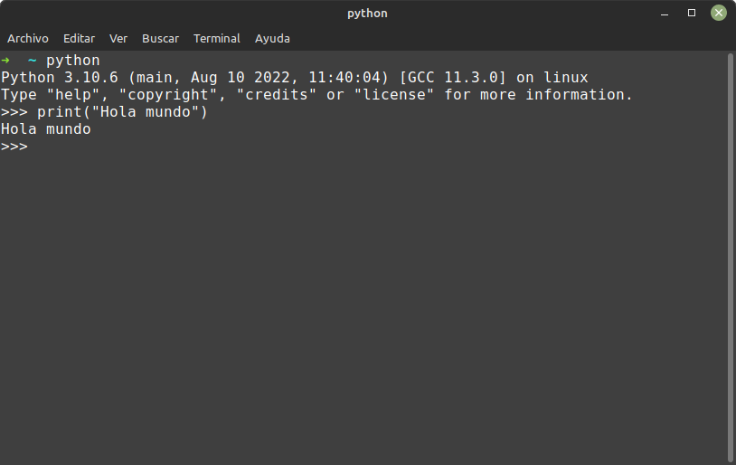
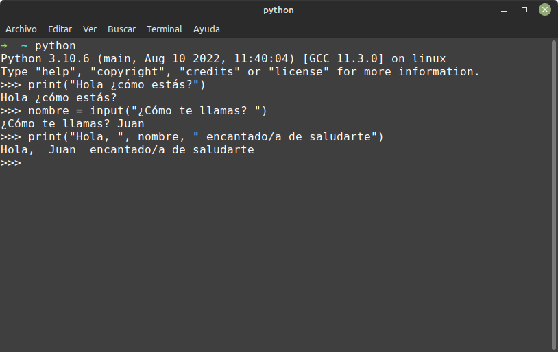
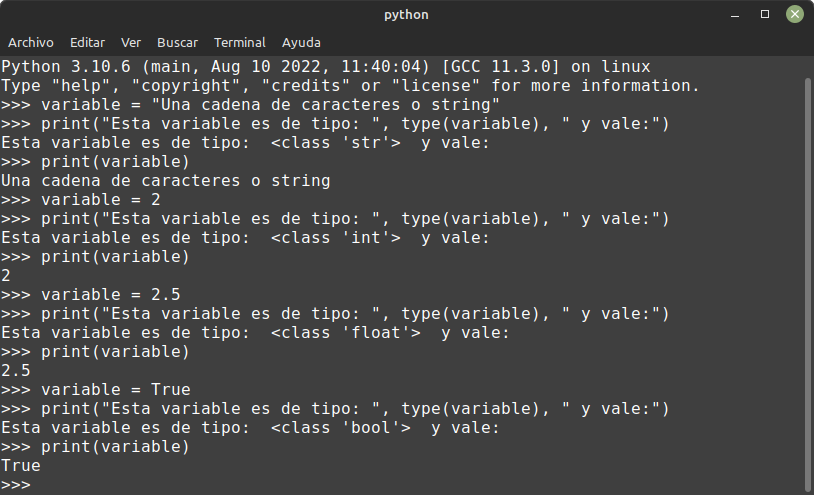
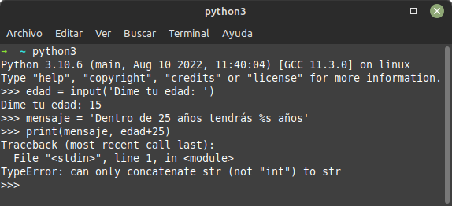
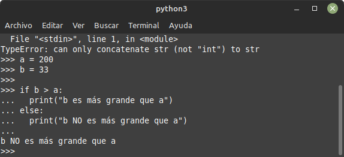

# Fundamentos de programación en Python

“When you want to know how things really work, study them when they're coming apart.”

― William Gibson, Zero History

Este tema forma parte del *Bloque I* (desarrollo de aplicaciones informáticas que procesan imágenes, audio y vídeo, como base de la creación digital) de la asignatura Creación Digital y Pensamiento Computacional.

En este tema aprenderemos:

* Conceptos de instrucción y secuenciación, algoritmo vs. código.
* Estructuras de control selectivas e iterativas (finitas e infinitas).
* Funciones.
* Introducción al uso de funciones gráficas (punto, línea, triángulo, cuadrado, rectángulo, círculo, elipse, sectores y arcos).

## Conceptos iniciales

Partimos de la base que sabemos **qué es un ordenador**, tanto el hardware, que es su estructura física (circuitos electrónicos, cables, caja o gabinete, teclado, ratón, etc.), y el software, que es su parte intangible (programas, datos, información, documentación, etc).

Desde el punto de vista funcional es una máquina que posee, al menos, una unidad central de procesamiento (CPU), una unidad de memoria y otra de entrada/salida (periféricos: pantalla, teclado, ratón, micrófono, cámara, tarjeta de red, puertos USB). Los periféricos de entrada permiten el ingreso de datos, la CPU se encarga de su procesamiento (operaciones aritmético-lógicas) y los dispositivos de salida los comunican a los medios externos. Es así, que la computadora recibe datos, los procesa y emite la información resultante, la que luego puede ser interpretada, almacenada, transmitida a otra máquina o dispositivo o sencillamente impresa; todo ello a criterio de un operador o usuario y bajo el control de un programa de computación.

Para *hablar* con los ordenadores, usamos lenguajes de programación.

Un **lenguaje de programación** es un lenguaje formal (o artificial, es decir, un lenguaje con reglas gramaticales bien definidas) que le proporciona a una persona, en este caso el programador, la capacidad de escribir (o programar) una serie de instrucciones o secuencias de órdenes en forma de algoritmos con el fin de controlar el comportamiento físico o lógico de un sistema informático, de manera que se puedan obtener diversas clases de datos o ejecutar determinadas tareas. A todo este conjunto de órdenes escritas mediante un lenguaje de programación se le denomina programa informático.

Al igual que idiomas, existen gran cantidad y variedad de lenguajes de programación, entre los que destacan por ser los más usados lenguajes como Python, C, Java, o JavaScript. Puedes consultar la lista de los más usados en prestigiosos índices como:

* [TIOBE](https://www.tiobe.com/tiobe-index/)
* [IEEE](https://spectrum.ieee.org/top-programming-languages-2022)

Nosotros vamos a usar el lenguaje de programación Python para todos nuestros ejercicios. Puedes instalar Python desde el App Store de tu sistema operativo o bien directamente desde [su página Web, haciendo clic aquí mismo.](https://www.python.org/downloads/). Debes instalar la versión 3.10 o superior porque hay estructuras de control como *switch-case* (lo veremos más adelante) que sólo están disponibles a partir de esta versión. Como entorno de desarrollo usaremos (Visual Studio Code)[https://code.visualstudio.com/download] con la *"Python Extension Pack"* añadida.

Cuando lo tengas instalado, abre una terminal de tu sistema operativo y ejecuta el comando python para entrar en modo interactivo. Cuando veas los símbolos **\>\>\>** copia y pega las órdenes de este tutorial para ir comprobando qué hacen. También puedes ir guardando cada ejercicio en un fichero con extensión *".py"* y desde la terminal ejecutando *python3 fichero.py* o bien desde el botón ejecutar de tu IDE (un IDE es un entorno de desarrollo, un software para programar) favorito.



### Instrucción

Llamamos instrucción a:

* cada una de las órdenes que una persona da al ordenador para que ejecute una operación.
* conjunto de datos insertados en una secuencia estructurada o específica que el procesador interpreta y ejecuta.

```python
print("Hola Mundo!!")
```

### Secuencia

Una secuencia de instrucciones son dos o más operaciones que se ejecutan una detrás de otra, en orden secuencial, de ahí su nombre.

A continuación vemos un ejemplo de una secuencia de tres instrucciones (si estás en modo interactivo copia y ejecuta línea a línea o no funcionará):

```python
print("Hola ¿cómo estás?")
nombre = input("¿Cómo te llamas? ")
print("Hola, ", nombre, " encantado/a de saludarte")
```



Sólo con estas tres líneas, estamos aprendiendo varios conceptos muy interesantes:

* el **operador** de *asignación*: cuando veas sólo un igual **=**, significa asignar, es decir, lo que haya a la derecha del igual se va a copiar en lo que haya a la izquierda del mismo.
* la **variable** *nombre*: una variable es como un nombre, es como llamamos a una zona de memoria RAM donde temporalmente almacenamos información que es relevante para el programa. En este caso la llamamos *nombre* para poder recordarla y consultarla cuando sea necesario. Fíjate cómo usamos el operador asignación (un igual) para indicar que la salida de la función que está a la derecha del mismo, se va a guardar en la variable *nombre* que está a la izquierda del igual.
* la **función** *print*: De manera muy intuitiva podemos afirmar que esta función lo que hará es mostrar un mensaje por pantalla. Fíjate cómo el mensaje va entre paréntesis. Es una instrucción de salida, porque la información fluye de 
* la **función** *input*: Esta función, como su nombre indica, pide al usuario que teclee algo y lo guarda en la variable donde hacemos la asignación.

### Algoritmo

Un algoritmo es un conjunto de instrucciones o reglas definidas y no-ambiguas, ordenadas y finitas que permite, típicamente, solucionar un problema, realizar un cómputo, procesar datos y llevar a cabo otras tareas o actividades.

### Código

El código fuente de un programa informático (o software) es un conjunto de líneas de texto con los pasos que debe seguir la computadora para ejecutar un programa.

El código fuente de un programa está escrito por un programador en algún lenguaje de programación legible por humanos, normalmente en forma de texto plano.​

Este código fuente escrito en un lenguaje legible por humanos no es directamente ejecutable por la computadora en su primer estado, sino que debe ser traducido a otro lenguaje o código binario; así será más fácil para la máquina interpretarlo (lenguaje máquina o código objeto que sí pueda ser ejecutado por el hardware de la computadora). Para esta traducción se usan los llamados compiladores, ensambladores, intérpretes, transpiladores y otros sistemas de traducción.

#### Tipos de datos en Python

Al igual que por ejemplo en matemáticas tenemos diferentes conjuntos para los números (naturales, enteros, racionales o reales, complejos o imaginarios...), en los lenguajes de programación, cada variable tiene asociado un tipo que indica qué representan los 0 y 1 que realmente están almacenados en la memoria RAM del ordenador.

En Python, todo valor que pueda ser asignado a una variable tiene asociado un tipo de dato (aunque en Python todas son objetos). Así que los tipos de datos serían los esqueletos o clases (donde se definen las propiedades del objeto y qué se puede hacer con él, ej: un coche tiene matrícula, marca, modelo, color, titular) y las variables serían las instancias (objetos que representan algo del mundo real, mi coche con matrícula: J-1234-A, color: blanco, marca: Reanult, modelo: Fuego...).

Ejemplos:

```python
# cadena / string
variable = "Una cadena de caracteres o string"
print("Esta variable es de tipo: ", type(variable), " y vale:")
print(variable)
# number / entero 
variable = 2
print("Esta variable es de tipo: ", type(variable), " y vale:")
print(variable)
# float / decimal
variable = 2.5
print("Esta variable es de tipo: ", type(variable), " y vale:")
print(variable)
# verdadero-falso / booleano
variable = True
print("Esta variable es de tipo: ", type(variable), " y vale:")
print(variable)
```



#### Números enteros

Los números enteros, *integer* para Python, es cualquier número, positivo o negativo, sin decimales y, muy importante, **de longitud ilimitada**.

Ejemplos:

```python
x = 2
y = 2342893749287492334356
z = -6555522
```

#### Números reales

Los números reales, en programación los llamamos **de coma flotante**, son cualquier número positivo o negativo, que contenga al menos un decimal.

Ejemplos:

```python
x = 3.141592
y = 1.0
z = -234.59
```

También es posible usar notación científica en Python (expresar números en potencia de 10):

```python
x = 3.5321e4
y = 12E4
z = -127.7e100
```

#### Números complejos

Aunque los números complejos probablemente no los uses salvo en ecuaciones diferenciales, algunos tipos de integrales en aerodinámica, hidrodinámica y electromagnetismo entre otras.

A diferencia nuestra (probablemente uses *i* para la parte imaginaria del número), en Python se usa la letra **j**:

```python
x = 3+5j
y = 5j
z = -5j
```

#### Conversión de números

Como ya vimos en un apartado anterior, cuando quiero pedirle a un usuario que introduzca un texto por pantalla, uso la función *input*. Esta función pide **un texto**, aunque yo introduzca un número, seguirá siendo de tipo texto, es decir no es lo mismo asignar x = 5, que x = '5' (si pongo comillas será el texto *5* sin ellas, el número *5*). Prueba el siguiente código (recuerda ir línea a línea copiando, pegando y ejecutando si estás en modo interactivo):

```python
edad = input('Dime tu edad: ')
mensaje = 'Dentro de 25 años tendrás %s años'
print(mensaje, edad+25)
```



Para solventar el error que da, tenemos que convertir la cadena de caracteres almacenada en la variable edad a un número. Para convertir a número tenemos las siguientes funciones:

```python
entero = int("27")
real = float("27.3")
imaginario = complex("2+3j")
```

Con estos ejemplos, ¿sabrías arreglar el error anterior? Inténtalo sin mirar la solución.

```python
textoEdad = input('Dime tu edad: ')
edad = int(textoEdad)
mensaje = 'Dentro de 25 años tendrás %s años'
print(mensaje, edad+25)
```

A la conversión de tipos también se le llama **casting** en el argot de los programadores.

#### Operadores

Operadores matemáticos:

Operador | Operación | Ejemplo
--------|-----------|--------
\+ | Suma | x + y
\- | Resta | x - y
\* | Multiplicación | x * y
/ | División | x / y
\*\* | Potencia | x**y
% | Módulo | x % y
// | División con redondeo | x // y

Al igual que pasa en matemáticas, en programación tenemos exactamente la misma precedencia de operadores, es decir en caso de concatenar operaciones, se harían primero las potencias, luego las multiplicaciones, divisiones, módulo y finalmente las sumas y restas. Compruébalo con estos ejemplos (verifica en tu ordenador qué resultado dan y piensa porqué):

```python
print( 2+3*5 ) # 17
print( (2+3)*5 ) # 20
```

Otros operadores de asignación:

Operador | Ejemplo | Equivalente a
---------|---------|--------
= | x = 5 | x = 5
+= | x += 3 | x = x + 3
-= | x -= 3 | x = x - 3
*= | x *= 3 | x = x * 3
/= | x /= 3 | x = x / 3
%= | x %= 3 | x = x % 3
//= | x //= 3 | x = x // 3
**= | x **= 3 | x = x ** 3
&= | x &= 3 | x = x & 3
|= | x |= 3 | x = x | 3
^= | x ^= 3 | x = x ^ 3
>>= | x >>= 3 | x = x >> 3
<<= | x <<= 3 | x = x << 3

Operadores de comparación:

Operador | Operación | Ejemplo
---------|-----------|--------
== | Igual a | x == y
!= | Distinto a | x != y
> | Mayor a | x > y
< | Menor a | x < y
>= | Mayor o igual a | x >= y
<= | Menor o igual a | x <= y

#### Booleanos

Una vez vistos los operadores de comparación, vamos a seguir con ellos y ver para qué los podemos usar. Si tecleamos esto en nuestro Python en modo interactivo:

```python
print(10 > 5)
print(5 == 9)
print(12 < 9) 
```

Veremos que devuelve:

```python
True
False
False
```

A esto es a lo que llamamos tipos booleanos, es decir, un tipo de dato binario que sólo tiene dos estados: verdadero y falso.

¿Para qué sirven estos tipos de datos? Nos ayudarán a tomar decisiones en nuestros programas y así ir por un camino u otro de nuestro código fuente, ejemplo:

```python
a = 200
b = 33

if b > a:
  print("b es más grande que a")
else:
  print("b NO es más grande que a") 
```

Si lo introduces en modo interactivo, copia y pega todo de golpe y al final tendrás que pulsar la tecla intro (o *Enter*) para indicar que la estructura de control ha terminado.



#### Strings

Los *strings* o cadena de carteres son variables de tipo texto, es decir almacenan información que contienen caracteres de texto. Sabemos que hablamos de cadenas de caracteres porque usamos comillas para darles valor, emeplo:

```python
cadena = "Esto es una variable de tipo cadena"
```

**Operaciones con strings**:

Con las cadenas de caracteres podemos:

Método  | Descripción
--------|------------
capitalize() | Convierte a mayúsculas todas las letras
count('a') | Cuenta cuantas 'a' hay en el string (puedes poner otros caracteres a contar)
find('mundo') | Busca dónde aparece la subcadena *mundo* dentro de la cadena dada 
format() | Sirve para dar formato
index(valor) | Busca y devuelve la primera ocurrencia de *valor* en la cadena
isdigit() | Devuelve verdadero si todos los caracteres son dígitos: 0-9
islower() | Devuelve verdadero si todas las letras están en mayúscula
isnumeric() | Devuelve verdadero si todos los caracteres son numéricos
isupper() | Devuelve verdadero si todas las letras están en mayúscula
join() | Convierte una lista en una cadena, es lo contratrio de split()
lower() | Pasa a minúsculas todas las letras
replace(valor1, valor2) | Sustituye cualquier ocurrencia de valor1 por valor2
rfind(valor) | Busca por la derecha de la cadena la primera ocurrencia de un valor y devuelve su posición
rindex(valor) | Busca por la derecha de la cadena la primera ocurrencia de un valor y devuelve su posición
split(parametro) | Parte una cadena en una lista de cadenas según el separador *parámetro*, es lo contrario de join()
startswith() | Devuelve verdadero
strip() | Elimina los caracteres en blaco del principio y el final
swapcase() | Cambia las mayúsculas a minúsculas y al revés
title() | Convierte A Formato Título Con La Primera En Mayúscula
upper() | Pasa a mayúsculas todas las letras

Veamos algunos ejemplos: 

El método count() retorna el número de veces que se repite un conjunto de caracteres especificado.

```python
    >>> s = "Hola mundo"
    >>> s.count("Hola")
    1
```

Los métodos find() e index() retornan la ubicación (comenzando desde el cero) en la que se encuentra el argumento indicado.

```python
    >>> s.find("mundo")
    5
    >>> s.index("mundo")
    5
```

Difieren en que esta última lanza ValueError cuando el argumento no es encontrado, mientras que aquélla retorna -1.

```python
    >>> s.find("world")
    -1
    >>> s.index("world")
    Traceback (most recent call last):
      File "<stdin>", line 1, in <module>
    ValueError: substring not found
```

En ambos métodos la búsqueda ocurre de izquierda a derecha. Para buscar un conjunto de caracteres desde el final, utilícense del mismo modo rfind() y rindex().

```python
    >>> s = "C:/python36/python.exe"
    >>> s.find("/")  # Retorna la primera ocurrencia.
    2
    >>> s.rfind("/")  # Retorna la última.
    11
```

startswith() y endswith() indican si la cadena en cuestión comienza o termina con el conjunto de caracteres pasados como argumento, y retornan True o False en función de ello.

```python
    >>> s = "Hola mundo"
    >>> s.startswith("Hola")
    True
    >>> s.endswith("mundo")
    True
    >>> s.endswith("world")
    False
```

Ambos métodos son preferidos ante la opción de emplear slicing.

```python
    # Se prefiere startswith().
    >>> s[:4] == "Hola"
    True
```

Veamos más ejemplos:

```python
cadena = "Hello world!"
# A partir del carácter 4 hasta el final 
cadena[4:]
# Los 4 primeros caracteres
cadena[:4]
# Desde la posición 2 a la 4
cadena[2:4]
# El carácter (letra) de la posición 6
cadena[6]
```

Si lo probamos en modo interactivo, veremos lo siguiente:

```python
>>> cadena = "Hello world!"
>>> cadena[4:]
'o world!'
>>> cadena[:4]
'Hell'
>>> cadena[2:4]
'll'
>>> cadena[6]
'w'
```

Los métodos isdigit(), isnumeric() e isdecimal() determinan si todos los caracteres de la cadena son dígitos, números o números decimales.

```python
    >>> "1234".isnumeric()
    True
    >>> "1234".isdecimal()
    True
    >>> "abc123".isdigit()
    False
```

Si bien estas definiciones resultan a priori similares, no lo son. La primera, isdigit(), considera caracteres que pueden formar números, incluidos aquellos correspondientes a lenguas orientales. isnumeric() es más amplia, pues incluye también caracteres de connotación numérica que no necesariamente son dígitos (por ejemplo, una fracción). La última, isdecimal(), es la más restrictiva al tener en cuenta únicamente números decimales; esto es, formados por dígitos del 0 al 9.

lower() y upper() retornan una copia de la cadena con todas sus letras en minúsculas o mayúsculas según corresponda.

```python
    >>> "Hola Mundo!".lower()
    'hola mundo!'
    >>> "Hola Mundo!".upper()
    'HOLA MUNDO!'
```

Las funciones strip(), lstrip() y rstrip() remueven los espacios en blanco que preceden y/o suceden a la cadena.

```python
    >>> s = " Hola mundo! "
    >>> s.strip()
    'Hola mundo!'
    # Remueve los de la derecha.
    >>> s.rstrip()
    ' Hola mundo!'
    # Remueve los de la izquierda.
    >>> s.lstrip()
    'Hola mundo! '
```

Por último, el método replace() -ampliamente utilizado- reemplaza una cadena por otra.

```python
    >>> s = "Hola mundo"
    >>> s.replace("mundo", "world")
    'Hola world'
```

El método de división de una cadena según un caracter separador más empleado es split(), cuyo separador por defecto son espacios en blanco y saltos de línea.

```python
    >>> "Hola mundo!\nHello world!".split()
    ['Hola', 'mundo!', 'Hello', 'world!']
```

El separador puede indicarse como argumento.

```python
    >>> "Hola mundo!\nHello world!".split(" ")
    ['Hola', 'mundo!\nHello', 'world!']
```

O bien, para separar únicamente según saltos de línea:

```python
    # Equivalente a split("\n").
    >>> "Hola mundo!\nHello world!".splitlines()
    ['Hola mundo!', 'Hello world!']
```

Un segundo argumento en split() indica cuál es el máximo de divisiones que puede tener lugar (-1 por defecto para representar una cantidad ilimitada).

```python
    >>> "Hola mundo hello world".split(" ", 2)
    ['Hola', 'mundo', 'hello world']
```

Un segundo método de separación es partition(), que retorna una tupla de tres elementos: el bloque de caracteres anterior a la primera ocurrencia del separador, el separador mismo, y el bloque posterior.

```python
    >>> s = "Hola mundo. Hello world!"
    >>> s.partition(" ")
    ('Hola', ' ', 'mundo. Hello world!')
```

**Strings dentro de strings**:

Es posible sustituir dentro de una cadena de caracteres otra cadena (o incluso otro tipo de dato). Veámoslo con un ejemplo, pruébalo en tu ordenador y fíjate cómo se sustituye **%s** por el número **1000**:

```python
puntos = 1000
mensaje = 'Has conseguido %s puntos'
print(mensaje % puntos)
```

* Primero usamos la cadena **%s** para indicar que eso debe ser sustituido.
* Luego usamos el operador **%** para decir que dentro de la variable *mensaje* sustituimos la cadena anterior por el contenido de la siguiente variable, que es *puntos*.

**Multiplícate por cero**:

Es posible multiplicar strings en Python y así conseguir curiosos efectos. Prueba a ver qué hace esto:

```python
print('-'*10, '='*5, '-'*10)
```

#### Listas o arrays

¿Qué son las listas? Las listas, como en la vida real, representan un conjunto ordenado (es importante este punto, están en orden y cada uno en su lugar) de cosas. Veamos un ejemplo con esta lista de la compra de Saruman (mago arcano muy conocido):

```python
listaCompra =  ['patas de araña', 'alas de murciélago', 
    'ojo de tritón', 'dedo gordo de una rana']
print(listaCompra)
print(listaCompra[2])
listaCompra[3] = 'mantequilla de babosa'
print(listaCompra)
```

¿Has probado qué muestran las tres instrucciones *print* de estas tres líneas de código fuente?

La primera instrucción *print* te muestra la lista entera, la segunda, el elemento en tercer lugar, curioso porque hemos puesto un 2, no un 3, pero recuerda que eso es así porque en informática siempre empezamos a contar en 0 (el tercer elemento de 0, 1, 2, 3, es el 2, uno menos). La tercera muestra una lista diferente, algo ha cambiado, ejecútalo en tu ordenador, fíjate bien e intenta explicar qué y porqué ha cambiado.

**Añadiendo elementos a una lista**:

Para añadir elementos a una lista usamos el método append. Ejemplo:

```python
listaCompra =  ['patas de araña', 'alas de murciélago', 
    'ojo de tritón', 'dedo gordo de una rana']
print(listaCompra)
listaCompra.append('cicuta')
listaCompra.append('eructo de oso')
print(listaCompra)
```

**Quitando elementos de una lista**:

Para eliminar elementos d ela lista usamos el comando del (abreviatura del inglés *delete*):

```python
listaCompra =  ['patas de araña', 'alas de murciélago', 
    'ojo de tritón', 'dedo gordo de una rana']
print(listaCompra)
del listaCompra[0]
del listaCompra[2]
print(listaCompra)
```

### Tuplas

Son como las listas pero usan paréntesis y son inmutables. ¿Qué significa inmutable? Pues prueba este código y observa el error que da:

```python
tupla = (1,2,3,4,5)
tupla[2] = 'pepe'
```

Como habrás comprobado dice que las tuplas no admiten asignación, es decir, no se puede modificar el contenido de la tupla después de crearlo, a diferencia de las listas que sí. A cambio, cuando iteramos o recorremos la tupla, Python lo hace de manera mucho más rápida y eficiente que cuando recorremos o iteramos sobre una lista.

#### Diccionarios

Los diccionarios podríamos verlos como un tipo de dato que representa un objeto. Los diccionarios se caracterizan por ir entre llaves y llevar un dato asociado a una clave de esta manera:

```python
    {clave: valor}
```

Donde la clave nos sirve para explicar qué dato almacena (ese dato sería el valor):

```python
persona = {'nombre': 'Juan', 'apellido':'García', 'edad':16}
persona['nombre']
```

## Estructuras de control selectivas e iterativas

Para entender mejor las estructuras de control, vamos a usar un paquete de Python llamado **turtle**. Así, de camino que aprendemos estructuras de control, hacemos una introducción al uso de funciones gráficas. En Ubuntu necesitaremos instalar el paquete Tk para disponer de las bibliotecas necesarias para usar ventanas en nuestros programas.

```bash
sudo apt install python3-tk
sudo apt install python3-pip
sudo pip3 install PythonTurtle
```

Si no dispones de un ordenador (Windows o Linux) donde instalar Python, puedes hacer esta parte del tutorial también online en esta Web: <https://www.pythonsandbox.com/turtle>. En ese mismo sitio Web también hay un resumen muy interesante de los comandos que vamos a usar: <https://www.pythonsandbox.com/turtle>.

### Cuadrado: el bucle for..in range()

Nuestro primer dibujo será un cuadrado, presta atención a las instrucciones avanza y gira a la izquierda.

```python
import turtle as tortuga

pantalla = tortuga.getscreen()

tortuga.forward(100)
tortuga.left(90)

tortuga.forward(100)
tortuga.left(90)

tortuga.forward(100)
tortuga.left(90)

tortuga.forward(100)
tortuga.left(90)

tortuga.done()
```

En donde:

* La instrucción *tortuga.getscreen()* nos "pinta" la ventana donde aparece la tortuga (el pequeño triángulo).
* La instrucción *tortuga.done()* espera a que cerremos la ventana para que podamos ver el dibujo que hagamos.
* La intrucción *tortuga.forward()* hace que avance la tortuga el número de espacios que se le indica.
* La instrucción *tortuga.left()* gira a la izquierda el número de grados indicados.

Por supuesto, muchos ya estaréis pensando, ¿y si las partes que se repiten las ponemos dentro de un bucle? Pues que entonces tendremos un programa mucho más sencillo, algo como esto:

```python
import turtle as tortuga

pantalla = tortuga.getscreen()

for contador in range(4):
    tortuga.forward(100)
    tortuga.left(90)

tortuga.done()
```

Fíjate bien en los espacios en blanco a la izquerda dentro del bucle for, así le indicamos a Python que esas instrucciones están *dentro* del *for*, A esto se le llama **identar** el código. Usaremos la tecla tabulador si el programa o IDE que usamos no lo hace de manera *automágica* por nosotros.

**RETOS:** Acabamos de ver cómo dibujar un cuadrado, ¿serías capaz de hacer un pentágono? ¿y un hexágono? ¿y un octógono? PISTA: según el número de vértices, tienes que cambiar el número de vueltas (iteraciones) que da el bucle *for* y los grados que giras.

Los bucles se pueden anidar, esto es, poner unos dentro de otros. Es importante tener en cuenta la identación, pues recuerda que según cómo lo movemos a la derecha con el tabulador, le indicamos a Python si una línea de código está dentro del bloque anterior. Prueba este código en tu ordenador a ver qué hace:

```python
# ahora parametrizamos lado y metemos dos FOR anidados
# esto pinta polígonos dentro de polígonos
lado = 10
for k in range (10):
    for i in range(8):
        print("Vuelta número: ",i)
        tortuga.forward(lado)
        tortuga.left(45)
    lado = lado + 20
```

**RETO:** Hemos visto cómo hacer que se pinten polígonos de más pequeño a más grande, pero, ¿serías capaz de hacerlo al revés? Pintar primero el más grande, luego dentro otro más pequeño y así sucesivamente. PISTA: Hay que *jugar* con la longitud del lado, pero ¡cuidado! *un lado no puede medir un número negativo*.

## Funciones

Tras dibujar un cuadrado, un hexágono y un octógono, vemos que parte del código se repite, de manera que se podría *parametrizar* (hacerlo genérico usando variables o parámetros). Si sabemos el número de vértices y la longitud de cada lado, podríamos pintar cualquier polígono (el triángulo sería una pequeña excepción a esta regla), sabiendo que cada vértice tendrá 360/n.vertices grados.

```python

import turtle as tortuga

pantalla = tortuga.getscreen()

def pintapoligono(lados, longitud):
    if (lados > 2):
        giro = 360 / lados
        for contador in range(lados):
            tortuga.forward(longitud)
            tortuga.left(giro)
    else:
        print("Error: no hay polígonos de menos de 3 lados")

pintapoligono(2, 50)
pintapoligono(4, 25)
pintapoligono(6, 25)
pintapoligono(8, 25)

tortuga.done()

```

También son funciones las que usamos para comunicarnos con la tortuga así por ejemplo tenemos las siguientes:

FUNCIÓN | EXPLICACIÓN
--------|-----------
tortuga.up() | Sube el lápiz (ya no pinta)
tortuga.down() | Baja el lápiz (ahora pinta)
tortuga.forward(n) | Avanza n "espacios"
tortuga.backward(n) | Retrocede n "espacios"
tortuga.left(n) | Gira a la izquierda "n" grados
tortuga.right(n) | Gira a la derecha "n" grados
tortuta.reset() | Borra la pantalla y la tortuga vuelve al inicio
tortuga.clear() | Borra la pantalla pero la tortuga se queda ahí
tortuga.pensize(n) | Establece el ancho de la línea a *n* píxeles
tortuga.pencolor( "red" ) | Pone el color del lápiz a rojo
tortuga.pencolor( (R,G,B) ) | Pone el color según la tupla R,G,B
tortuga.fillcolor( "red" ) | Rellena con el color rojo
tortuga.fillcolor( (R,G,B) ) | Rellena con el color según la tupla R,G,B

También podemos colorear combinando funciones, ejemplo:

```python
turtle.color("black", "red")
turtle.begin_fill()
turtle.circle(80)
turtle.end_fill()
```

**RETOS:** ¿Te está gustando la tortuga de Python? Ahora te proponemos unos retos para que practiques:

1. Dibuja la bandera de España con la tortuga. Extra: ¡ponle un mástil!
2. Dibuja una casita (como la que hacen los niños pequeños, con figuras geométricas sólo: triángulos, cuadrados y rectángulos)
3. Dibuja un barco (como los que hacen los niños pequeños, con figuras geométricas sólo: triángulos, cuadrados y rectángulos)

## Introducción al uso de funciones gráficas

Ya hemos visto con turtle lo básico (punto, línea, triángulo, cuadrado, rectángulo, círculo, elipse, sectores y arcos), ahora es el momento de pasar a TkInter, la biblioteca gráfica de Python.

TO-DO.

\pagebreak
